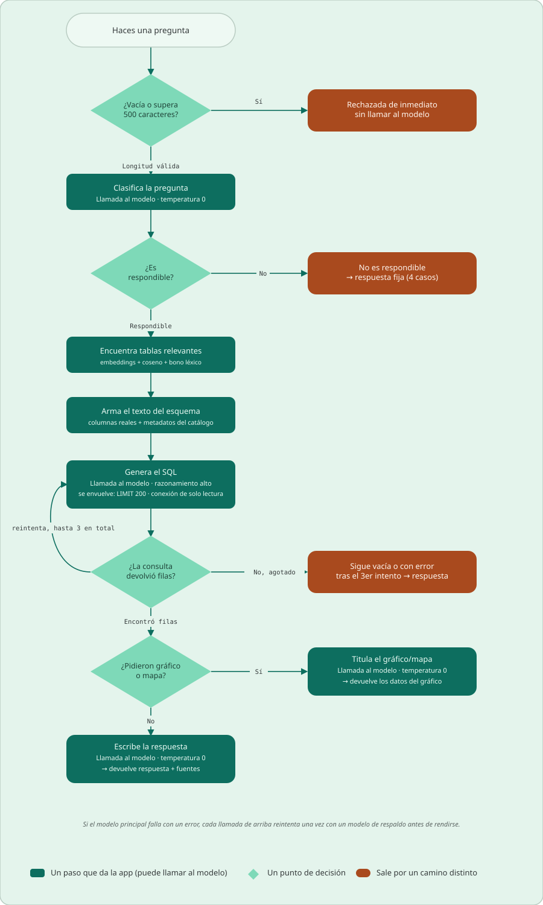

<p align="center">
  
</p>

<p align="center">
  <a href="README.md">🇬🇧 English</a> | 🇪🇸 Español
</p>

<a href="LICENSE"></a>

# Chat de estadísticas de Colombia

**statsco_ai** es una aplicación de chat de código abierto que responde preguntas
sobre estadísticas oficiales de Colombia en lenguaje natural, en **español o
inglés**. Preguntas algo como *"¿Cuál fue la tasa de desempleo en Antioquia en
2023?"* y la aplicación encuentra las tablas adecuadas, escribe una consulta SQL,
la ejecuta sobre una base de datos SQLite local y responde con el resultado y sus
fuentes, o con un gráfico interactivo si lo pediste.

Cubre PIB, inflación (IPC), mercado laboral, productividad, deuda y déficit
públicos, pobreza, tasas de interés y de cambio, salario mínimo y demografía
(población, nacimientos, defunciones y migración), entre otras.

## Índice

- [Demo en vivo](#demo-en-vivo)
- [Estado](#estado)
- [Funcionalidades](#funcionalidades)
- [Cómo funciona](#cómo-funciona)
- [Tecnologías](#tecnologías)
- [Fuentes de datos](#fuentes-de-datos)
- [Estructura del proyecto](#estructura-del-proyecto)
- [Ejecutarlo localmente](#ejecutarlo-localmente)
  - [1. Requisitos previos](#1-requisitos-previos)
  - [2. Clonar el repositorio](#2-clonar-el-repositorio)
  - [3. Crear el entorno de Python](#3-crear-el-entorno-de-python)
  - [4. Obtener la base de datos](#4-obtener-la-base-de-datos)
  - [5. Desactivar la descarga en la nube (R2 / boto3)](#5-desactivar-la-descarga-en-la-nube-r2--boto3)
  - [6. Añadir tu clave de API](#6-añadir-tu-clave-de-api)
  - [7. Elegir los modelos](#7-elegir-los-modelos)
  - [8. Ejecutar la aplicación](#8-ejecutar-la-aplicación)
  - [9. Cambiar los límites](#9-cambiar-los-límites)
  - [10. Solución de problemas](#10-solución-de-problemas)
- [Licencia](#licencia)
- [Contacto](#contacto)

## Demo en vivo

- **Aplicación web:** <https://statscoai.streamlit.app/>

## Estado

El proyecto está en desarrollo activo. La base de datos se actualiza dos veces al
mes con las últimas publicaciones de cada fuente, y con el tiempo se pueden añadir nuevos
conjuntos de datos o funcionalidades. Toda la interfaz está disponible en
**español e inglés**.

## Funcionalidades

- **Pregunta en español o inglés.** El idioma se toma del navegador y se puede
  cambiar antes del primer mensaje. Las preguntas deben escribirse en el idioma de
  la interfaz.
- **Respuestas en lenguaje natural con fuentes.** Cada respuesta indica de qué
  conjuntos de datos proviene.
- **Gráficos bajo pedido.** Incluye *graficar*, *gráfico* o *gráfica* y obtendrás
  un gráfico interactivo con vistas de Línea, Barras y Tabla en lugar de texto.
- **Mapas por departamento.** Pide *"departamento por departamento"* para obtener
  un mapa coroplético de Colombia.
- **Preguntas independientes.** Cada pregunta se responde por separado; el
  historial del chat se te muestra, pero nunca se le envía al modelo.
- **Protecciones.** Las preguntas vacías, demasiado largas, fuera de tema, poco
  claras o maliciosas reciben una respuesta predefinida antes de tocar los datos;
  el SQL generado se ejecuta en una conexión de solo lectura y con un límite de
  filas.
- **Tema claro/oscuro** y diseño **adaptado a móviles**.
- **Límites de uso diarios, por usuario y globales,** para controlar el costo de la API (configurables,
  ver [Cambiar los límites](#9-cambiar-los-límites)).

## Cómo funciona

<p align="center">
  
</p>

1. **Filtros iniciales:** las preguntas vacías o de más de 500 caracteres se
   rechazan sin llamar al modelo.
2. **Filtro de respondibilidad:** una llamada al modelo clasifica la pregunta como
   respondible, fuera de alcance, poco clara, en el idioma equivocado o maliciosa.
   Solo las respondibles continúan. Aquí también se traducen al inglés las
   preguntas en español.
3. **Búsqueda de tablas:** la pregunta se convierte en un vector con
   `all-MiniLM-L6-v2` y se compara con cada tabla por similitud coseno, más una
   pequeña bonificación por palabras del título de la tabla. Se conservan las
   mejores tablas y las tablas de referencia que necesitan.
4. **Texto del esquema:** las columnas reales de esas tablas se combinan con las
   descripciones, unidades y valores permitidos guardados en la propia base de
   datos.
5. **Generación de SQL:** el modelo escribe una consulta, que se envuelve en un
   límite de filas y se ejecuta en una conexión de **solo lectura**. Si falla o no
   devuelve filas, el modelo recibe la consulta fallida y el motivo, y lo intenta de
   nuevo (hasta 3 intentos).
6. **Respuesta:** las filas vuelven al modelo, que redacta la respuesta en tu
   idioma y añade las fuentes. Si pediste un gráfico o un mapa, se omite la
   respuesta en texto y las filas se dibujan con Plotly.

## Paquetes

- **Streamlit:** interfaz web y alojamiento
- **SDK de OpenAI para Python:** llama a cualquier API de modelos compatible con
  OpenAI (Gemini, OpenAI, OpenRouter, Ollama, …)
- **sentence-transformers** (`all-MiniLM-L6-v2`): vectores para la búsqueda de
  tablas
- **SQLite:** la base de datos de estadísticas (`data/colombia.db`)
- **pandas** y **Plotly:** manejo de datos y gráficos

## Fuentes de datos

- **DANE:** Departamento Administrativo Nacional de Estadística
- **Banco de la República:** el banco central de Colombia
- **Ministerio de Hacienda:** deuda pública y balance fiscal
- **Banco Mundial:** migración neta
- **Migración Colombia / Datos Abiertos:** viajeros entrantes y salientes, a
  través de la plataforma de datos abiertos de Colombia

## Estructura del proyecto

```
streamlit_app.py        ← punto de entrada: la interfaz del chat
src/
  pipeline.py           ← answer_question: filtro → gate → búsqueda → SQL → respuesta/gráfico
  prompts.py            ← prompts del gate, el SQL, la respuesta y el título del gráfico
  model.py              ← cliente del modelo (principal → respaldo), extracción del SQL
  catalog.py            ← lee los metadatos de la base de datos como texto del esquema
  retrieval.py          ← vectores y ranking de tablas
  charts.py             ← vistas de Plotly: Línea/Barras/Tabla/Mapa
  rate_limit.py         ← límite de uso por usuario
  constants.py          ← todos los ajustes (modelos, límites, palabras clave)
  i18n.py, translations.py, ui_copy.py, mobile.py, components.py
images/                 ← logo, íconos y los diagramas del proceso
data/
  colombia.db           ← la base de datos de estadísticas (no está en el repo, ver abajo)
  colombia_departments.geojson  ← formas de los departamentos para el mapa
.streamlit/
  config.toml           ← tema claro/oscuro
  secrets.toml          ← tu clave de API (la creas tú)
```

## Ejecutarlo localmente

Ejecutar la aplicación en tu computador requiere algunos pasos manuales: necesitas
la base de datos (se entrega por solicitud), tu propia clave de API de un modelo y
una pequeña edición para desactivar la descarga en la nube que solo usa la versión
publicada. Sigue los pasos en orden.

### 1. Requisitos previos

- **Python 3.11** (la versión con la que se desarrolla y prueba el proyecto).
- **Git**, o descargar el repositorio como ZIP desde GitHub.
- Unos **2 GB de espacio libre** en disco (la base de datos pesa 1,8 GB y el
  modelo de vectores unos 90 MB).
- Una **clave de API** de un proveedor de modelos compatible con OpenAI (Google
  Gemini, OpenAI, OpenRouter, un servidor local de Ollama, …). La aplicación llama
  al modelo varias veces por pregunta, y tu proveedor cobra ese uso.

### 2. Clonar el repositorio

```bash
git clone https://github.com/Andres-pixel35/statsco-ai.git
cd statsco-ai
```

### 3. Crear el entorno de Python

Con **conda** (recomendado, fija Python 3.11 por ti):

```bash
conda env create -f conda/environment.yml
conda activate statsco_ai
```

Esto requiere conda-rattler-solver 0.1.1 o más reciente: los solvers anteriores no
pueden leer el índice de paquetes del canal `conda-pypi` y fallan con
`invalid bracket key: extras` (en `boto3`). Si te pasa, actualízalos primero y
vuelve a intentarlo:

```bash
conda update -n base conda conda-rattler-solver
```

O con **venv + pip**:

```bash
python3.11 -m venv .venv
source .venv/bin/activate        # Windows: .venv\Scripts\activate
pip install -r requirements.txt
```

`boto3` aparece en las dependencias solo porque la versión publicada descarga la
base de datos desde un bucket privado. Puedes quitarlo de `requirements.txt` /
`conda/environment.yml` antes de instalar si también haces el paso 5.

### 4. Obtener la base de datos

La aplicación lee todo de `data/colombia.db` (1,8 GB). No está en el repositorio,
y el bucket en la nube desde el que la descarga la versión publicada (Cloudflare
R2) es **privado**, así que no puedes obtenerla por tu cuenta.

**Para conseguirla, envía un correo a statistics-colombia@proton.me y te la
compartiremos.** Luego coloca el archivo en:

```
statsco-ai/data/colombia.db
```

### 5. Desactivar la descarga en la nube (R2 / boto3)

El código todavía crea un cliente de boto3 con las credenciales privadas de R2
apenas arranca. Sin esas credenciales (no las tienes y no las necesitas) la
aplicación falla al iniciar. **Comenta** o **borra** las siguientes líneas, como
prefieras.

En **`src/pipeline.py`**, el import y el cliente:

```python
import boto3
```

```python
s3 = boto3.client(
    "s3",
    endpoint_url=st.secrets["r2"]["endpoint_url"],
    aws_access_key_id=st.secrets["r2"]["access_key_id"],
    aws_secret_access_key=st.secrets["r2"]["secret_access_key"],
    region_name="auto",
)
```

En **`streamlit_app.py`**, quita `s3` del import:

```python
from src.pipeline import answer_question, s3   # antes
from src.pipeline import answer_question       # después
```

y la función `download_db` junto con su llamada:

```python
@st.cache_resource(show_spinner=False)
def download_db():
    ...  # la función completa

    download_db()  # su llamada, dentro del bloque try de arranque
```

Después de esto `boto3` ya no se usa y puedes desinstalarlo
(`pip uninstall boto3`) si lo instalaste.

### 6. Añadir tu clave de API

Crea el archivo **`.streamlit/secrets.toml`** (la carpeta `.streamlit/` ya existe)
con este contenido:

```toml
[api]
key = "tu-clave-de-api"
base_url = "https://tu-proveedor.com/v1"
```

- `key`: la clave de API de tu proveedor.
- `base_url`: el endpoint **compatible con OpenAI** del proveedor. La aplicación
  usa el paquete de Python `openai`, así que funciona cualquier proveedor que
  hable la API de Chat Completions de OpenAI. Algunos ejemplos:

  | Proveedor | `base_url` |
  |---|---|
  | Google Gemini | `https://generativelanguage.googleapis.com/v1beta/openai/` |
  | OpenRouter | `https://openrouter.ai/api/v1` |
  | Ollama (local) | `http://localhost:11434/v1` (cualquier `key` no vacía) |

- **¿Usas OpenAI directamente? Omite `base_url`.** Sin él, el paquete `openai`
  usa su endpoint por defecto (`https://api.openai.com/v1`):

  ```toml
  [api]
  key = "sk-..."
  ```

### 7. Elegir los modelos

Los modelos se definen en **`src/constants.py`**. Por defecto son modelos de
Gemini, así que, si no usas Gemini, debes cambiarlos por modelos que ofrezca tu
proveedor:

```python
MODEL = "gemini-3.5-flash-lite"            # se usa en todas las llamadas
MODEL_FALLBACK = "gemini-3.1-flash-lite"   # se intenta una vez si MODEL falla

REASONING_EFFORT_QUERY = "high"     # solo para generar SQL
REASONING_EFFORT_DEFAULT = "medium" # gate, título del gráfico, respuesta final
```

- **¿No quieres un modelo de respaldo?** Pon `MODEL_FALLBACK = MODEL`. Así, una
  llamada fallida simplemente se reintenta una vez con el mismo modelo antes de
  que la aplicación muestre su mensaje de "modelo no disponible". No hace falta
  ningún otro cambio.
- **¿Tu modelo no admite `reasoning_effort`?** Pon `REASONING_EFFORT_QUERY` y
  `REASONING_EFFORT_DEFAULT` en `None`; así el parámetro no se envía.
- La calidad de las respuestas depende mucho del modelo: tiene que escribir SQL
  correcto sobre un esquema grande, así que los modelos locales muy pequeños
  fallarán a menudo.

### 8. Ejecutar la aplicación

Desde la raíz del repositorio, con el entorno activado:

```bash
streamlit run streamlit_app.py
```

La aplicación se abre en tu navegador en `http://localhost:8501`.

En la **primera ejecución** se descarga desde Hugging Face el modelo de vectores
`sentence-transformers/all-MiniLM-L6-v2` (unos 90 MB), por lo que el arranque
tarda más. Se guarda en la caché de Hugging Face y las siguientes ejecuciones lo
cargan desde allí, sin internet:

- Linux / macOS: `~/.cache/huggingface/hub/models--sentence-transformers--all-MiniLM-L6-v2`
- Windows: `C:\Users\<tu-usuario>\.cache\huggingface\hub\models--sentence-transformers--all-MiniLM-L6-v2`

Para guardarlo en otro lugar, define la variable de entorno `HF_HOME` antes de
ejecutar la aplicación (el modelo irá entonces a `$HF_HOME/hub/`). Para
eliminarlo, borra esa carpeta.

### 9. Cambiar los límites

Todos los límites están en **`src/constants.py`**. Los valores por defecto están
pensados para la aplicación pública; para uso personal probablemente quieras
subir los límites de uso.

| Ajuste | Por defecto | Qué hace |
|---|---|---|
| `RATE_LIMIT_PER_DAY` | `3` | Preguntas respondidas permitidas por usuario al día. Una pregunta que falla porque no se pudo contactar al modelo no cuenta. El día se reinicia a medianoche, hora de Colombia (UTC-5). |
| `RATE_LIMIT_GLOBAL_PER_DAY` | `200` | Preguntas respondidas permitidas al día entre **todos** los usuarios juntos, un tope fijo al gasto de la API. Se reinicia igual que el anterior. |
| `RATE_LIMIT_SECONDS` | `60` | Segundos mínimos entre dos preguntas del mismo usuario (cuenta toda pregunta, respondida o no). |
| `MAX_QUESTION_CHARS` | `500` | Las preguntas más largas se rechazan antes de llamar al modelo. |
| `SQL_MAX_ATTEMPTS` | `3` | Intentos para escribir una consulta SQL que funcione (cada uno es una llamada al modelo). |
| `SQL_ROW_LIMIT` | `200` | Máximo de filas que puede devolver una consulta. |

Los límites de uso se cuentan por dirección IP y se guardan en memoria, así que se
reinician cada vez que reinicias la aplicación. Reiníciala después de editar
`constants.py` para que los cambios se apliquen. Los comentarios en
`constants.py` explican por qué cada valor es el que es; léelos antes de cambiar
cualquier otra cosa allí.

### 10. Solución de problemas

- **Un traceback en la terminal que menciona `st.secrets["r2"]` o `boto3`** (el
  navegador solo muestra un error genérico): el código de R2 del paso 5 sigue
  activo. Los tracebacks nunca se muestran en el navegador (`showErrorDetails =
  "none"` en `.streamlit/config.toml`); cámbialo a `"full"` ahí para verlos
  mientras desarrollas.
- **"Algo salió mal de nuestra parte"**: el error real aparece en la terminal
  donde ejecutaste `streamlit run`. Al arrancar suele deberse a que falta
  `data/colombia.db`.
- **"No pude obtener respuesta del modelo de IA"**: fallaron tanto `MODEL` como
  `MODEL_FALLBACK`. Revisa que `.streamlit/secrets.toml` exista en la raíz del
  repositorio, la `key`, el `base_url` y que los nombres de los modelos existan
  en tu proveedor. Algunos modelos rechazan `temperature=0` o `reasoning_effort`;
  el registro de la terminal muestra el mensaje de error del proveedor.
- **Llegaste al límite diario mientras pruebas**: sube `RATE_LIMIT_PER_DAY` (o
  `RATE_LIMIT_GLOBAL_PER_DAY`, paso 9) y reinicia la aplicación.

## Licencia

Este proyecto está licenciado bajo la **Licencia Pública General de GNU v3.0
(GPL-3.0)**. Consulta el archivo [LICENSE](LICENSE) para más detalles.

## Contacto

¿Preguntas, sugerencias, errores o quieres la base de datos? Escríbeme a
**statistics-colombia@proton.me**.
