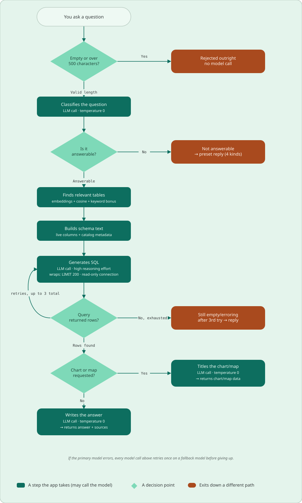

<p align="center">
  
</p>

<p align="center">
  🇬🇧 English | <a href="README.es.md">🇪🇸 Español</a>
</p>

<a href="LICENSE"></a>

# Colombia statistics chat

**statsco_ai** is an open-source chat app that answers questions about Colombian
official statistics in plain language, in **English or Spanish**. You ask
something like *"What was the unemployment rate in Antioquia in 2023?"* and the app
finds the right tables, writes an SQL query, runs it against a local SQLite
database, and replies with the answer and its sources, or with an interactive
chart if you asked for one.

It covers GDP, inflation (CPI), the job market, productivity, public debt and
deficit, poverty, interest and exchange rates, the minimum wage, and demographics
(population, births, deaths and migration), among others.

## Table of contents

- [Live demo](#live-demo)
- [Status](#status)
- [Features](#features)
- [How it works](#how-it-works)
- [Tech stack](#tech-stack)
- [Data sources](#data-sources)
- [Project structure](#project-structure)
- [Running it locally](#running-it-locally)
  - [1. Prerequisites](#1-prerequisites)
  - [2. Clone the repository](#2-clone-the-repository)
  - [3. Create the Python environment](#3-create-the-python-environment)
  - [4. Get the database](#4-get-the-database)
  - [5. Disable the cloud download (R2 / boto3)](#5-disable-the-cloud-download-r2--boto3)
  - [6. Add your API key](#6-add-your-api-key)
  - [7. Choose your models](#7-choose-your-models)
  - [8. Run the app](#8-run-the-app)
  - [9. Change the limits](#9-change-the-limits)
  - [10. Troubleshooting](#10-troubleshooting)
- [License](#license)
- [Contact](#contact)

## Live demo

- **Web app:** _coming soon_ <!-- TODO: add the live app URL -->

## Status

The project is under active development. The database is updated twice a month with
the latest releases from each source, and new datasets or features may be added over
time. The whole interface is available in **English and Spanish**.

## Features

- **Ask in English or Spanish.** The language is picked from your browser and can
  be changed before the first message. Questions must be written in the interface
  language.
- **Plain-language answers with sources.** Every answer lists the datasets it came
  from.
- **Charts on request.** Include *plot*, *chart* or *graph* and you get an
  interactive chart with Line, Bar and Table views instead of text.
- **Department maps.** Ask *"department by department"* to get a choropleth map of
  Colombia.
- **Independent questions.** Each question is answered on its own; the chat history
  is shown to you but never fed back to the model.
- **Safeguards.** Questions that are empty, too long, off-topic, unclear or
  malicious get a canned reply before any data is touched; generated SQL runs on a
  read-only connection with a row cap.
- **Light/dark theme** and **mobile-friendly** layout.
- **Per-user and global daily rate limits** to keep API costs under control (configurable, see
  [Change the limits](#9-change-the-limits)).

## How it works

<p align="center">
  
</p>

1. **Guards:** empty questions and questions over 500 characters are rejected
   without calling the model.
2. **Answerability gate:** one model call classifies the question as answerable,
   out of scope, unclear, in the wrong language, or malicious. Only answerable
   questions go on. Spanish questions are also translated to English here.
3. **Table retrieval:** the question is embedded with `all-MiniLM-L6-v2` and ranked
   against every table by cosine similarity plus a small bonus for words from the
   table's title. The top tables, plus the lookup tables they need, are kept.
4. **Schema text:** the live columns of those tables are combined with the
   descriptions, units and allowed values stored in the database itself.
5. **SQL generation:** the model writes a query, which is wrapped in a row limit
   and run on a **read-only** connection. If it fails or returns no rows, the model
   gets the failed query and the reason and tries again (up to 3 attempts).
6. **Answer:** the rows go back to the model to write the answer in your language,
   with the sources appended. If you asked for a chart or map, the text answer is
   skipped and the rows are drawn with Plotly.

## Tech stack

- **Streamlit:** web interface and hosting
- **OpenAI Python SDK:** calls any OpenAI-compatible model API (Gemini, OpenAI,
  OpenRouter, Ollama, …)
- **sentence-transformers** (`all-MiniLM-L6-v2`): embeddings for table retrieval
- **SQLite:** the statistics database (`data/colombia.db`)
- **pandas** and **Plotly:** data handling and charts

## Data sources

- **DANE:** Colombia's National Administrative Department of Statistics
- **Banco de la República:** Colombia's central bank
- **Ministerio de Hacienda:** public debt and fiscal balance
- **World Bank:** net migration
- **Migración Colombia / Datos Abiertos:** inbound/outbound travelers, via
  Colombia's open-data platform

## Project structure

```
streamlit_app.py        ← entry point: the chat UI
src/
  pipeline.py           ← answer_question: guard → gate → retrieve → SQL → answer/chart
  prompts.py            ← prompts for the gate, SQL, answer and chart title
  model.py              ← model client (primary → fallback), SQL extraction
  catalog.py            ← reads the database's own metadata into schema text
  retrieval.py          ← embeddings and table ranking
  charts.py             ← Plotly Line/Bar/Table/Map views
  rate_limit.py         ← per-user throttle
  constants.py          ← every tunable setting (models, limits, keywords)
  i18n.py, translations.py, ui_copy.py, mobile.py, components.py
images/                 ← logo, icons and the pipeline diagrams
data/
  colombia.db           ← the statistics database (not in the repo, see below)
  colombia_departments.geojson  ← department shapes for the map
.streamlit/
  config.toml           ← light/dark theme
  secrets.toml          ← your API key (you create it)
```

## Running it locally

Running the app on your own machine takes a few manual steps: you need the
database (on request), your own model API key, and a small edit to switch off the
cloud download that only the hosted version uses. Follow the steps in order.

### 1. Prerequisites

- **Python 3.11** (the version the project is developed and tested with).
- **Git**, or download the repository as a ZIP from GitHub.
- About **2 GB of free disk space** (the database is 1.8 GB, the embedding model
  about 90 MB).
- An **API key** for an OpenAI-compatible model provider (Google Gemini, OpenAI,
  OpenRouter, a local Ollama server, …). The app calls the model several times per
  question, so usage is billed by your provider.

### 2. Clone the repository

```bash
git clone https://github.com/Andres-pixel35/statsco-ai.git
cd statsco-ai
```

### 3. Create the Python environment

With **conda** (recommended, it pins Python 3.11 for you):

```bash
conda env create -f conda/environment.yml
conda activate statsco_ai
```

This needs conda-rattler-solver 0.1.1 or newer: older solvers can't read the
`conda-pypi` channel's package index and fail with `invalid bracket key: extras`
(on `boto3`). If that happens, update them first and retry:

```bash
conda update -n base conda conda-rattler-solver
```

Or with **venv + pip**:

```bash
python3.11 -m venv .venv
source .venv/bin/activate        # Windows: .venv\Scripts\activate
pip install -r requirements.txt
```

`boto3` is listed in the requirements only because the hosted version downloads
the database from a private bucket. You can remove it from `requirements.txt` /
`conda/environment.yml` before installing if you also do step 5.

### 4. Get the database

The app reads everything from `data/colombia.db` (1.8 GB). It is not in the
repository, and the cloud bucket the hosted app downloads it from (Cloudflare R2)
is **private**, so you cannot fetch it yourself.

**To get it, send an email to statistics-colombia@proton.me and we will share it
with you.** Then place the file at:

```
statsco-ai/data/colombia.db
```

### 5. Disable the cloud download (R2 / boto3)

The code still creates a boto3 client with the private R2 credentials as soon as
it starts. Without those credentials (you don't have them, and you don't need
them) the app crashes on startup. Either **comment out** or **delete** the
following lines, whichever you prefer.

In **`src/pipeline.py`**, the import and the client:

```python
import boto3
```

```python
s3 = boto3.client(
    "s3",
    endpoint_url=st.secrets["r2"]["endpoint_url"],
    aws_access_key_id=st.secrets["r2"]["access_key_id"],
    aws_secret_access_key=st.secrets["r2"]["secret_access_key"],
    region_name="auto",
)
```

In **`streamlit_app.py`**, remove `s3` from the import:

```python
from src.pipeline import answer_question, s3   # before
from src.pipeline import answer_question       # after
```

and the `download_db` function plus its call:

```python
@st.cache_resource(show_spinner=False)
def download_db():
    ...  # the whole function

    download_db()  # its call, inside the startup try block
```

After this, `boto3` is no longer used and you can uninstall it
(`pip uninstall boto3`) if you installed it.

### 6. Add your API key

Create the file **`.streamlit/secrets.toml`** (the `.streamlit/` folder already
exists) with this content:

```toml
[api]
key = "your-api-key"
base_url = "https://your-provider.com/v1"
```

- `key`: your provider's API key.
- `base_url`: the provider's **OpenAI-compatible** endpoint. The app uses the
  `openai` Python package, so any provider that speaks the OpenAI Chat Completions
  API works. Some examples:

  | Provider | `base_url` |
  |---|---|
  | Google Gemini | `https://generativelanguage.googleapis.com/v1beta/openai/` |
  | OpenRouter | `https://openrouter.ai/api/v1` |
  | Ollama (local) | `http://localhost:11434/v1` (any non-empty `key`) |

- **Using OpenAI directly? Leave `base_url` out.** Without it the `openai`
  package uses its default endpoint (`https://api.openai.com/v1`):

  ```toml
  [api]
  key = "sk-..."
  ```

### 7. Choose your models

The models are set in **`src/constants.py`**. The defaults are Gemini models, so
unless you use Gemini you must change them to models your provider serves:

```python
MODEL = "gemini-3.5-flash-lite"            # used for every call
MODEL_FALLBACK = "gemini-3.1-flash-lite"   # tried once if MODEL fails

REASONING_EFFORT_QUERY = "high"     # SQL generation only
REASONING_EFFORT_DEFAULT = "medium" # gate, chart title, final answer
```

- **No fallback model?** Set `MODEL_FALLBACK = MODEL`. A failed call is then just
  retried once on the same model before the app shows its "model unavailable"
  message. No other change is needed.
- **Model doesn't support `reasoning_effort`?** Set both `REASONING_EFFORT_QUERY`
  and `REASONING_EFFORT_DEFAULT` to `None`; the parameter is then not sent.
- Answer quality depends heavily on the model: it has to write correct SQL over a
  large schema, so very small local models will often fail.

### 8. Run the app

From the repository root, with the environment active:

```bash
streamlit run streamlit_app.py
```

The app opens in your browser at `http://localhost:8501`.

On the **first run** the embedding model `sentence-transformers/all-MiniLM-L6-v2`
(about 90 MB) is downloaded from Hugging Face, so startup takes longer. It is
stored in the Hugging Face cache and later runs load it from there, without
internet:

- Linux / macOS: `~/.cache/huggingface/hub/models--sentence-transformers--all-MiniLM-L6-v2`
- Windows: `C:\Users\<you>\.cache\huggingface\hub\models--sentence-transformers--all-MiniLM-L6-v2`

To keep it somewhere else, set the `HF_HOME` environment variable before running
the app (the model then goes to `$HF_HOME/hub/`). To remove it, delete that folder.

### 9. Change the limits

All limits live in **`src/constants.py`**. The defaults are tuned for the public
app; for your own use you will probably want to raise the rate limits.

| Setting | Default | What it does |
|---|---|---|
| `RATE_LIMIT_PER_DAY` | `3` | Answered questions allowed per user per day. A question that fails because the model can't be reached doesn't count. The day resets at midnight Colombia time (UTC-5). |
| `RATE_LIMIT_GLOBAL_PER_DAY` | `200` | Answered questions allowed per day across **all** users combined, a hard ceiling on API spend. Same reset as above. |
| `RATE_LIMIT_SECONDS` | `60` | Minimum seconds between two questions from the same user (counts every question, answered or not). |
| `MAX_QUESTION_CHARS` | `500` | Longer questions are rejected before any model call. |
| `SQL_MAX_ATTEMPTS` | `3` | Tries to write a working SQL query (each one is a model call). |
| `SQL_ROW_LIMIT` | `200` | Maximum rows any query can return. |

Rate limits are counted per IP address and kept in memory, so they reset whenever
you restart the app. Restart it after editing `constants.py` for the changes to
apply. The comments in `constants.py` explain why each value is what it is; read
them before changing anything else there.

### 10. Troubleshooting

- **A traceback in the terminal mentioning `st.secrets["r2"]` or `boto3`** (the
  browser only shows a generic error): the R2 code from step 5 is still active.
  Tracebacks are never shown in the browser (`showErrorDetails = "none"` in
  `.streamlit/config.toml`); set it to `"full"` there to see them while developing.
- **"Something went wrong on our side"**: the real error is printed in the
  terminal where you ran `streamlit run`. At startup it is usually a missing
  `data/colombia.db`.
- **"I couldn't get a response from the AI model"**: both `MODEL` and
  `MODEL_FALLBACK` failed. Check that `.streamlit/secrets.toml` exists in the
  repository root, the `key`, the `base_url`, and that the model names exist on
  your provider. Some models reject `temperature=0` or `reasoning_effort`; the
  terminal log shows the provider's error message.
- **You hit the daily limit while testing**: raise `RATE_LIMIT_PER_DAY` (or
  `RATE_LIMIT_GLOBAL_PER_DAY`, step 9) and restart the app.

## License

This project is licensed under the **GNU General Public License v3.0
(GPL-3.0)**. See the [LICENSE](LICENSE) file for details.

## Contact

Questions, suggestions, bugs, or want the database? Reach me at
**statistics-colombia@proton.me**.
